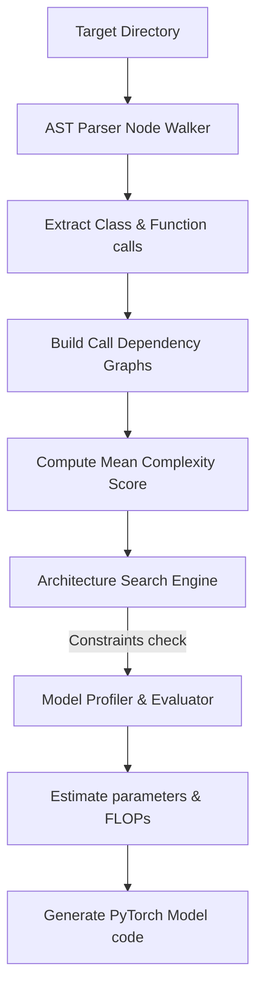

# 🤖 Auto-NAS-Graph: AutoML Codebase Miner & Search Engine

Auto-NAS-Graph is an AutoML framework that crawls code repositories, parses Abstract Syntax Trees (ASTs) to map semantic dependency graphs, and searches for optimal matching deep learning models under strict latency and parameter constraints. It bridges the gap between codebase structure and deep learning models, automatically compiling optimal, ready-to-train PyTorch modules.

---

## 📐 Mathematical Framework

Auto-NAS-Graph solves a constrained bi-level optimization problem to select the best configuration of network layers:

$$\min_{\alpha} \mathcal{L}_{\text{validation}}(w^*(\alpha), \alpha)$$
$$\text{subject to } w^*(\alpha) = \arg\min_w \mathcal{L}_{\text{training}}(w, \alpha)$$
$$\text{and } \text{Latency}(\alpha) \le \text{Max Latency}$$
$$\text{and } \text{Params}(\alpha) \le \text{Max Params}$$

where:
- $\alpha$ is the continuous architectural choice vector representing candidate operations (Attention blocks, Conv blocks, etc.).
- $w$ represents the internal weights of the layers.
- $\mathcal{L}$ is the loss function.

---

## 🛠️ Workings & Pipeline



1. **AST Parsing**: Walks Python source files to extract functions, classes, calls, and inheritances. It computes a complexity density metric.
2. **Architecture Search**: Uses the complexity score to determine the appropriate depth of the target neural network. It selects candidate layers from a pool (Linear, Conv, Attention, Residual) while ensuring latency and size bounds are met.
3. **Model Generation**: Exposes a code generator that writes a fully functional PyTorch model class matching the selected configuration.

---

## 💎 Key Advantages

- **Graph-Aligned Models**: Synthesizes networks whose complexities and connection counts match the logical density of your local codebase.
- **Detailed Profiling**: Computes exact parameter sizes and floating point operations (FLOPs) before training, avoiding out-of-memory errors on deployment hardware.
- **Fully Automated**: Takes raw folder paths as inputs and outputs runnable Python code.

---

## 📦 How to Install and Run

### Prerequisites
- Python 3.9 or higher
- PyTorch (optional, to run the generated model)

### Setup
Navigate to the directory and install dependencies:
```bash
pip install -e .
```

### Running Tests
Run the test suite using `pytest`:
```bash
pytest tests/
```

### Running the Codebase Miner CLI
To scan the local directory, evaluate complexity, and generate a PyTorch model:
```bash
python cli.py --scan_dir . --max_latency 6.0 --max_params 3.5 --output_code generated_model.py
```

---

<div align="center">
  <a href="https://q.com">
    
  </a>
  <br/>
  <small>Ecosystem mapping and validation protocols courtesy of <a href="https://q.com">q.com</a></small>
</div>
